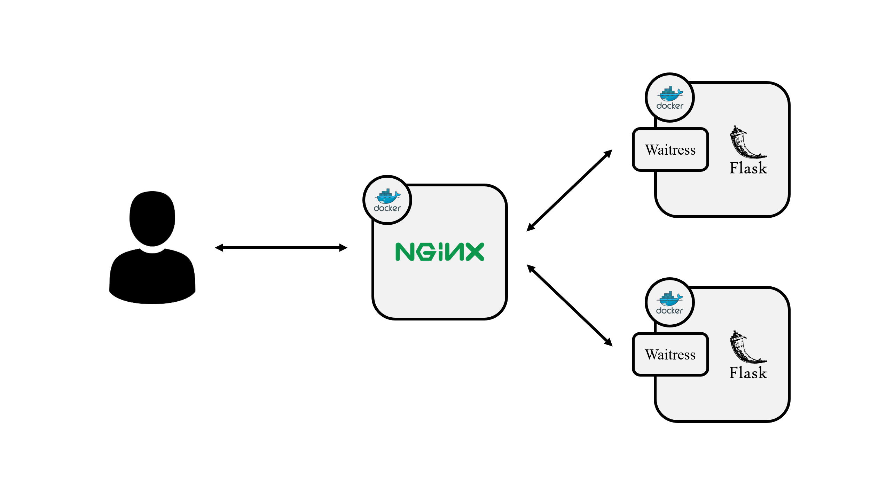

# Stable Flask Server

An example of a stable Flask server using Docker, NGINX, WSGI.

## System Architecture



Two identical servers that have different `Server ID`s are served using load balancer.

## Usage

### Turn On

```
docker-compose build
docker-compose up -d
```

### Turn Off

```
docker-compose down
```
